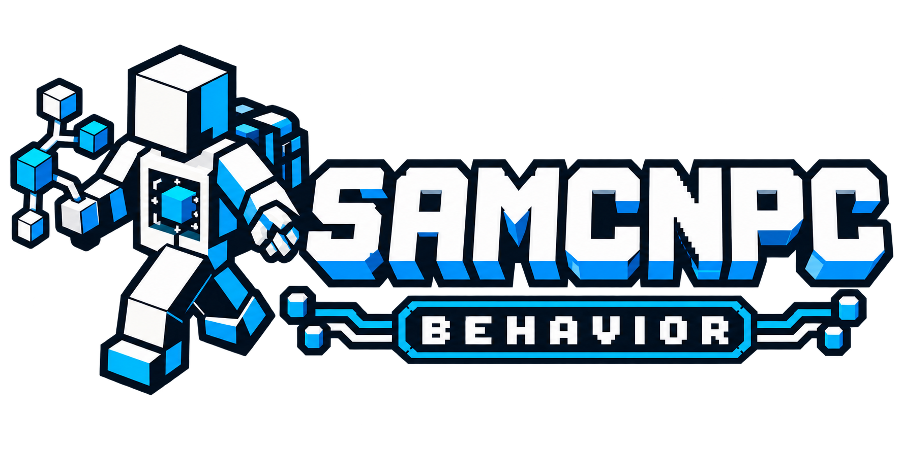

<p align="center"></p>

# SAMCNPC Behavior

[English](#english) · [Polski](#polski) · [Deutsch](#deutsch)

> Early development source publication · Minecraft 1.20.1 · Forge 47.4.21 · Java 17 · Kotlin for Forge 4.12.0

<a id="english"></a>
## English

**Deterministic behavior, durable operations and external missions for Minecraft Forge 1.20.1.**

Immutable JSON packs evaluate observations and arbitrate action channels deterministically. Seventeen typed operation families cover navigation, inventory preparation, transport, supported resource work, soil, farming, fishing, machines and combat. ItemQuery shares inventory/equipment semantics, exact item IDs and usable-tool selection. Authorized logistics can acquire missing equipment or free inventory space without resetting the parent task budget. Native ZIP reload is bounded and transactional. Finite missions bind each stage to an exact admitted task and verify explicit postconditions; final stock is reobserved at completion. Uncertain restart boundaries or changed packs hold for review.

### Requirements and build

Requires matching Core and Kotlin for Forge. No model or HTTP provider is needed. Dependencies are pinned; use compatible module revisions.
The umbrella SAMCNPC checkout records the tested sibling revisions. This repository
contains no dependency Git submodules and never downloads sibling source code during a build.

```bash
./gradlew clean build "-PsamcnpcCoreDir=../samcnpc-core"
```

Use `gradlew.bat` on Windows. In PowerShell, quote each `-Pname=path` argument.
Building from the umbrella checkout configures the sibling projects automatically.
JARs are written under `build/libs/`; do not install sources or development remapping artifacts.

### Evaluation

Test new work in disposable worlds. Provide an exact revision, input document,
initial world/inventory, reproduction steps and the actual outcome in bug reports.
Compilation alone is not evidence of physical navigation, combat, persistence or skin behavior.
The two-authenticated-account skin/refresh check remains MANUAL_PENDING and nonblocking;
automated loading, permissions, synchronization and persistence checks remain required.

<a id="polski"></a>
## Polski

**Deterministyczne zachowania, trwałe operacje i zewnętrzne misje dla Minecraft Forge 1.20.1.**

Niemutowalne paczki JSON obserwują stan i deterministycznie rozstrzygają kanały działań. Siedemnaście rodzin operacji obejmuje nawigację, ekwipunek, transport, obsługiwane prace przy surowcach, glebie, uprawach, łowieniu, maszynach i walce. ItemQuery współdzieli znaczenie przedmiotów i wyposażenia. Dozwolona logistyka uzupełnia narzędzia i zwalnia miejsce bez odnawiania budżetu zadania. ZIP jest wczytywany z limitami i transakcyjnie. Skończona misja wiąże etap z konkretnym zadaniem; zapas końcowy jest ponownie sprawdzany. Niepewny restart lub zmieniona paczka wymagają przeglądu.

Zestaw docelowy: Minecraft 1.20.1, Forge 47.4.21, Java 17 i Kotlin for Forge 4.12.0.
Zgodne wersje zależności są wymagane. Główne repozytorium SAMCNPC przypina rewizje
sąsiednich modułów; tutaj nie ma zagnieżdżonych submodułów Git. Polecenie kompilacji
znajduje się wyżej; Windows używa `gradlew.bat`, a argumenty `-Pname=path` w PowerShell
należy ująć w cudzysłowy. JAR powstaje w `build/libs/`.

Nowe funkcje sprawdzaj na jednorazowych światach. Zgłoszenie powinno zawierać rewizję,
dokument wejściowy, stan początkowy i odtwarzalne kroki. Sam wynik kompilacji nie
potwierdza zachowania w grze. Wizualny test skina z dwoma kontami pozostaje
MANUAL_PENDING; testy automatyczne nadal obowiązują.

<a id="deutsch"></a>
## Deutsch

**Deterministisches Verhalten, persistente Operationen und externe Missionen für Minecraft Forge 1.20.1.**

Unveränderliche JSON-Pakete lesen Beobachtungen und entscheiden deterministisch über Aktionskanäle. Siebzehn Operationsfamilien umfassen Navigation, Inventar, Transport, unterstützte Ressourcenarbeit, Boden, Anbau, Angeln, Maschinen und Kampf. ItemQuery vereinheitlicht Gegenstands- und Ausrüstungsmerkmale. Erlaubte Logistik beschafft Werkzeuge oder schafft Platz, ohne das Aufgabenbudget zurückzusetzen. ZIP-Neuladen ist begrenzt und transaktional. Endliche Missionen binden jede Stufe an eine genaue Aufgabe und prüfen Endbestände erneut. Unklare Neustarts oder geänderte Pakete erfordern Prüfung.

Zielplattform: Minecraft 1.20.1, Forge 47.4.21, Java 17 und Kotlin for Forge 4.12.0.
Kompatible Abhängigkeitsversionen sind erforderlich. Das Hauptrepository SAMCNPC
pinnt die benachbarten Modulrevisionen; dieses Repository hat keine verschachtelten
Git-Submodule. Der Build-Befehl steht oben. Unter Windows `gradlew.bat` verwenden;
PowerShell-Argumente `-Pname=path` in Anführungszeichen setzen. JAR-Ausgabe: `build/libs/`.

Neue Funktionen in entbehrlichen Welten testen. Fehlerberichte brauchen Revision,
Eingabedokument, Ausgangszustand und reproduzierbare Schritte. Kompilierung allein
belegt kein Spielverhalten. Der visuelle Skin-Test mit zwei Konten bleibt
MANUAL_PENDING; automatisierte Prüfungen bleiben erforderlich.

## License

See [LICENSE](LICENSE). Minecraft and third-party dependencies retain their own terms.

## External authoring

Loose rule JSON: `config/samcnpc/behaviors/`. Native ZIP: `resources/samcnpc/behaviors/`.
Use `/samcnpc behavior reload`; failed reload retains the last valid registry.
`/samcnpc behavior mission list` lists loaded missions. Start/status/pause/resume/cancel
are separate mission commands. Pack assignment alone does not create an operation.

See [local preparation](docs/LOCAL_AUTONOMY.md), [ZIP format](docs/EXTERNAL_BEHAVIOR_ZIPS.md)
and [mission semantics](docs/MISSIONS.md).
